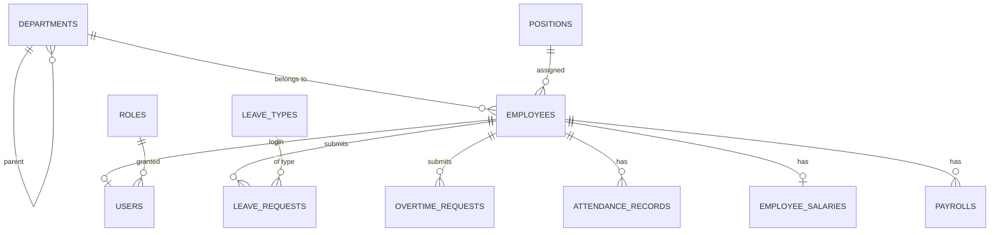

# 人事管理系統設計文件 (system-design)

> 狀態: 設計階段（尚未有程式碼）。本文件是後續 scaffolding 的唯一依據，實作前請先與本文件對齊。

## 1. 系統概觀

單體式 (monolith) 三層架構：

```
Vue 3 SPA (Vue Router + Pinia + Axios)
        │  JWT Bearer (HTTPS)
        ▼
ASP.NET Web API (REST, Swagger, EF Core)
        │
        ▼
PostgreSQL (localhost:5432)
```

- 前端：Vue 3 admin SPA，`Sidebar + Header + Content` 佈局，滾動路由守衛控權。
- 後端：REST API，統一前綴 `/api/v1`，JWT 認證 + 角色授權。
- 資料庫：PostgreSQL，EF Core 作 ORM，Migration 放後端專案。
- 不 commit 任何密碼/金鑰（見 AGENTS.md）。

## 2. 角色與權限 (RBAC)

四種角色，權限以**後端為準**，前端僅做 UI 隱藏。

| 角色 | 說明 | 可存取 |
|------|------|--------|
| `admin`    | 系統管理員 | 全部；另可管使用者與角色 |
| `hr`       | 人事 | 組織/員工、出勤/請假/加班、薪資、查閱員工名冊 |
| `manager`  | 部門主管 | 審核部屬的請假/加班、檢視部屬出勤與薪資 |
| `employee` | 一般員工 | 個人上下班打卡、申請請假/加班、查看自己的薪資單 |

權限以 `permission code` 字串控管 (如 `employee.create`、`leave.approve`)，
`Role` 對映多個 code；前端依 code 過濾 Sidebar 與按鈕。

## 3. 資料模型 (ER)



### 3.1 組織與員工

**departments**（部門，樹狀）
| 欄位 | 型別 | 說明 |
|------|------|------|
| id | bigint | PK, identity |
| parent_id | bigint? | 父部門，NULL=根 |
| code | text | 部門代碼，唯一 |
| name | text | 部門名稱 |
| manager_id | bigint? | 部門主管（employees.id） |
| is_active | boolean | 軟刪除用 |

**positions**（職位）
| 欄位 | 型別 | 說明 |
|------|------|------|
| id | bigint | PK |
| code | text | 唯一 |
| name | text | 職位名稱 |
| department_id | bigint? | 預設所屬部門 |
| level | int | 職級（1=最高） |

**employees**（員工）
| 欄位 | 型別 | 說明 |
|------|------|------|
| id | bigint | PK |
| employee_no | text | 工號，唯一 |
| name | text | 姓名 |
| gender | int | 0/1/2 對應 未設定/男/女 |
| birth_date | date | 生日 |
| phone | text | 手機 |
| email | text | |
| address | text | |
| hire_date | date | 到職日 |
| leave_date | date? | 離職日，NULL=在職 |
| employment_status | text | `active`/`on_leave`/`resigned` |
| department_id | bigint | FK→departments |
| position_id | bigint | FK→positions |
| manager_id | bigint? | 直屬主管（employees.id） |

> 主資料皆加 `created_at`/`updated_at`（timestamptz），刪除一律 `is_active=false` 軟刪除（薪資、出勤等流水資料除外）。

### 3.2 出勤與請假

**leave_types**（假別）
| 欄位 | 型別 | 說明 |
|------|------|------|
| id | bigint | PK |
| code | text | `annual`/`sick`/`personal`/`marriage`/`maternity`/... 唯一 |
| name | text | 假別名稱 |
| annual_quota | numeric | 每年配額（天），NULL=無上限 |
| is_paid | boolean | 是否支薪假 |
| is_active | boolean | |

**leave_requests**（請假單）
| 欄位 | 型別 | 說明 |
|------|------|------|
| id | bigint | PK |
| employee_id | bigint | FK→employees |
| leave_type_id | bigint | FK→leave_types |
| start_at | timestamptz | 開始 |
| end_at | timestamptz | 結束 |
| days | numeric | 請假天數 |
| reason | text | 事由 |
| status | text | `pending`/`approved`/`rejected`/`cancelled` |
| approver_id | bigint? | 審核者 |
| approved_at | timestamptz? | |

**overtime_requests**（加班單）
| 欄位 | 型別 | 說明 |
|------|------|------|
| id | bigint | PK |
| employee_id | bigint | |
| work_date | date | 加班日 |
| start_at / end_at | timestamptz | 起迄 |
| hours | numeric | 加班時數 |
| reason | text | |
| status | text | `pending`/`approved`/`rejected` |
| approver_id | bigint? | |

**attendance_records**（打卡記錄）
| 欄位 | 型別 | 說明 |
|------|------|------|
| id | bigint | PK |
| employee_id | bigint | |
| work_date | date | 當天 |
| clock_in_at | timestamptz? | 上班打卡 |
| clock_out_at | timestamptz? | 下班打卡 |
| work_hours | numeric | 實際工時 |
| late_minutes | int | 遲到分鐘 |
| early_leave_minutes | int | 早退分鐘 |
| status | text | `normal`/`late`/`early_leave`/`absent`/`holiday` |

> 假別與加班審核通過後，自動回寫相關出勤狀態；每月產生出勤統計報表（不落表，查詢時彙總）。

### 3.3 薪資

**employee_salaries**（員工薪資結構，一人一筆，改動用版本歷史另行記錄）
| 欄位 | 型別 | 說明 |
|------|------|------|
| id | bigint | PK |
| employee_id | bigint | 唯一 |
| base_salary | numeric(18,2) | 底薪 |
| position_allowance | numeric(18,2) | 職務加給 |
| meal_allowance | numeric(18,2) | 伙食津貼 |
| effective_date | date | 生效日 |

**payrolls**（月結薪資）
| 欄位 | 型別 | 說明 |
|------|------|------|
| id | bigint | PK |
| period | int | `YYYYMM`，e.g. `202609` |
| employee_id | bigint | |
| base_salary + allowances | numeric(18,2) | 應發項目 |
| overtime_pay | numeric(18,2) | 加班費（由核准加班單計算） |
| bonus | numeric(18,2) | 獎金 |
| leave_deduction | numeric(18,2) | 請假扣款 |
| insurance_deduction | numeric(18,2) | 勞健保/勞退自付額 |
| tax_withheld | numeric(18,2) | 所得稅預扣 |
| gross_pay | numeric(18,2) | 應發 |
| net_pay | numeric(18,2) | 實發 = gross − 各項扣款 |
| status | text | `draft`/`confirmed`/`paid` |
| generated_by | bigint | 產生者 |

> 金額一律 `numeric(18,2)`，禁止 float。勞健保級距等規則為可維護設定，第一版先用可設定的固定級距表（另行 `payroll_settings` 表）。

### 3.4 帳號與權限

**users**
| 欄位 | 型別 | 說明 |
|------|------|------|
| id | bigint | PK |
| employee_id | bigint? | 可為空（純系統帳號） |
| email | text | 唯一，登入帳號 |
| password_hash | text | PBKDF2/BCrypt，禁止明文或 commit |
| role_id | bigint | FK→roles |
| is_active | boolean | |

**roles**
| 欄位 | 型別 | 說明 |
|------|------|------|
| id | bigint | PK |
| code | text | `admin`/`hr`/`manager`/`employee` |
| name | text | |

**role_permissions**
| 欄位 | 型別 | 說明 |
|------|------|------|
| role_id | bigint | PK(複合) |
| permission_code | text | PK(複合)，e.g. `employee.create` |

## 4. API 設計

統一 `/api/v1` 前綴，回應格式：`{ "data": ..., "error": { "code": "...", "message": "..." } }`。
List 皆支援分頁 `page` / `pageSize` 與查詢參數。

| 模組 | Method | Path | 說明 |
|------|--------|------|------|
| Auth | POST | `/auth/login` | 登入，回傳 JWT + 使用者資訊 |
| Auth | GET | `/auth/me` | 目前登入者資訊與權限 |
| 組織 | GET | `/departments/tree` | 部門樹 |
| 組織 | GET/POST/PUT/DELETE | `/departments` | 部門 CRUD |
| 組織 | GET | `/positions` | 職位列表 |
| 組織 | GET/POST/PUT/DELETE | `/positions` | 職位 CRUD |
| 組織 | GET | `/employees` | 員工列表（篩選：部門/狀態/關鍵字） |
| 組織 | GET/POST/PUT | `/employees/{id}` | 員工明細/新增/修改 |
| 出勤 | POST | `/attendance/me/clock-in` | 本人上班打卡 |
| 出勤 | POST | `/attendance/me/clock-out` | 本人下班打卡 |
| 出勤 | GET | `/attendance/records` | 出勤記錄（HR/主管可查，員工限本人） |
| 請假 | GET | `/leave-types` | 假別（含配額） |
| 請假 | GET/POST | `/leave-requests` | 個人請假單列表/申請 |
| 請假 | PUT | `/leave-requests/{id}/approve` | 審核（approve/reject 以 action 區分） |
| 加班 | GET/POST | `/overtime-requests` | 個人加班單列表/申請 |
| 加班 | PUT | `/overtime-requests/{id}/approve` | 審核 |
| 薪資 | GET | `/payrolls` | 薪資單列表（員工限本人） |
| 薪資 | GET | `/payrolls/{id}` | 薪資單明細 |
| 薪資 | POST | `/payrolls/generate` | 依 `period` 生成月結（HR） |
| 薪資 | PUT | `/payrolls/{id}/confirm` | 確認/發放 |
| 薪資 | GET/PUT | `/employee-salaries/{employeeId}` | 薪資結構檢視/調整（HR） |
| 帳號 | GET/POST/PUT | `/users` | 使用者管理（admin） |
| 帳號 | GET | `/roles` | 角色列表（admin） |
| 儀表板 | GET | `/dashboard/summary` | 聚合統計（依權限回傳員工/薪資/出勤/待審/個人各 section） |

審核類 (approve) 一律做「本人不可審自己」與「僅直屬主管/HR 可審」檢查。

## 5. 前端結構

```
src/
  main.ts                       # App 掛載 + Pinia + Router
  router/index.ts               # 路由；含 JWT 存在與否守衛
  stores/auth.ts                # JWT、user、permissions (Pinia)
  services/http.ts              # Axios instance：自動帶 Authorization、401 時登出
  services/dashboard.ts         # 儀表板聚合統計 API
  layouts/AdminLayout.vue       # Sidebar + Header + router-view
  views/
    auth/Login.vue
    dashboard/Index.vue         # Chart.js 圖表儀表板（部門/職位人數、薪資趨勢與狀態、出勤、待審、個人概況）
    organization/Departments.vue
    organization/Employees.vue
    attendance/Records.vue
    attendance/LeaveRequests.vue
    attendance/OvertimeRequests.vue
    payroll/Payrolls.vue
    system/Users.vue
    system/Roles.vue
  components/                   # 共用表格、表單、Tree、時間選擇、審核按鈕等
```

- 路由表含 `meta.permission`，BeforeEach 比對 `auth stores` 的 permissions，不足導向 403。
- 日期一律顯示臺灣本地時區；API 傳 `ISO 8601`（含時區）。
- UI 庫未定（AGENTS.md 尚可更動）——選型後統一使用，不做混搭。
- Sidebar 選單依權限動態產出，員工/主管/HR 看到的項目不同。

## 6. 開發里程碑

| 里程碑 | 內容 | 驗收 | 狀態 |
|--------|------|------|------|
| M0 | Scaffold：後端 WebAPI + EF Core + Postgres 連線；前端 Vue3 + login；JWT/RBAC 基本登入流程 | 四種角色能登入 | ✅ 已實作 |
| M1 | 組織與員工 CRUD（部門樹、職位、員工、軟刪除） | HR 可完整維護人員 | ✅ 已實作 |
| M2 | 出勤與請假（打卡、請假/加班申請與審核、出勤記錄） | 員工可打卡請假，主管可審 | ✅ 已實作 |
| M3 | 薪資（薪資結構、月結生成、薪資單、發放狀態） | 可產出並鎖定月薪資 | ✅ 已實作 |
| M4 | 權限細節 + 操作紀錄 (audit log) + 收尾 | 後端權限皆驗證、操作可追蹤 | ⬜ 待實作 |

## 7. 非功能性規則

- 時間統一 Timestamp with time zone（Postgres `timestamptz`）。
- 所有對外 API DTO 與資料庫 Entity 分離，不直接暴露 Entity。
- 列表一律分頁；無分頁的 `tree` 類標記為例外。
- Migration 由 EF Core tools 產生並隨程式碼 commit（不含連線字串與密碼）。
- 敏感設定只放 `appsettings.Development.json`（gitignored）/ `dotnet user-secrets` / 前端 `.env.local`。